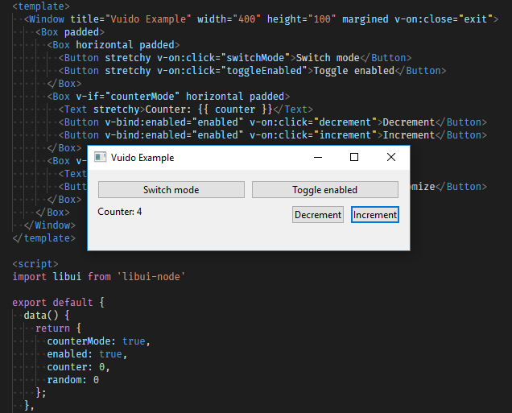

# Vuido

Create native desktop applications for Windows, OS X and Linux using Vue.js.

 

## Introduction

Vuido makes it possible to create lightweight, native desktop applications using Vue.js. Applications using Vuido can run on Windows, OS X and Linux, using native GUI components, and don't require Electron.

Under the hood, Vuido uses the [libui](https://github.com/andlabs/libui) library which provides native GUI components for each desktop platform, and the [libui-node](https://github.com/parro-it/libui-node) bindings for Node.js.

Vuido supports most of the standard Vue.js API and it's compatible with many Vue.js extensions, for example Vuex. Applications using Vuido can also use all standard Node.js modules and any packages compatible with Node.js.

## Development status

At the moment Vuido is in a very early stage of development. The first goal is to implement all controls currently supported by libui and to write a documentation.

## Acknowledgements

Vuido is largely based on Vue.js and shares most of its code, except for the platform specific code related to libui.

Vuido was inspired by [Proton Native](https://github.com/kusti8/proton-native), an environment for creating native desktop applications using React.

## License

Vuido is licensed under the MIT license

Copyright \(C\) 2018 Michał Męciński

